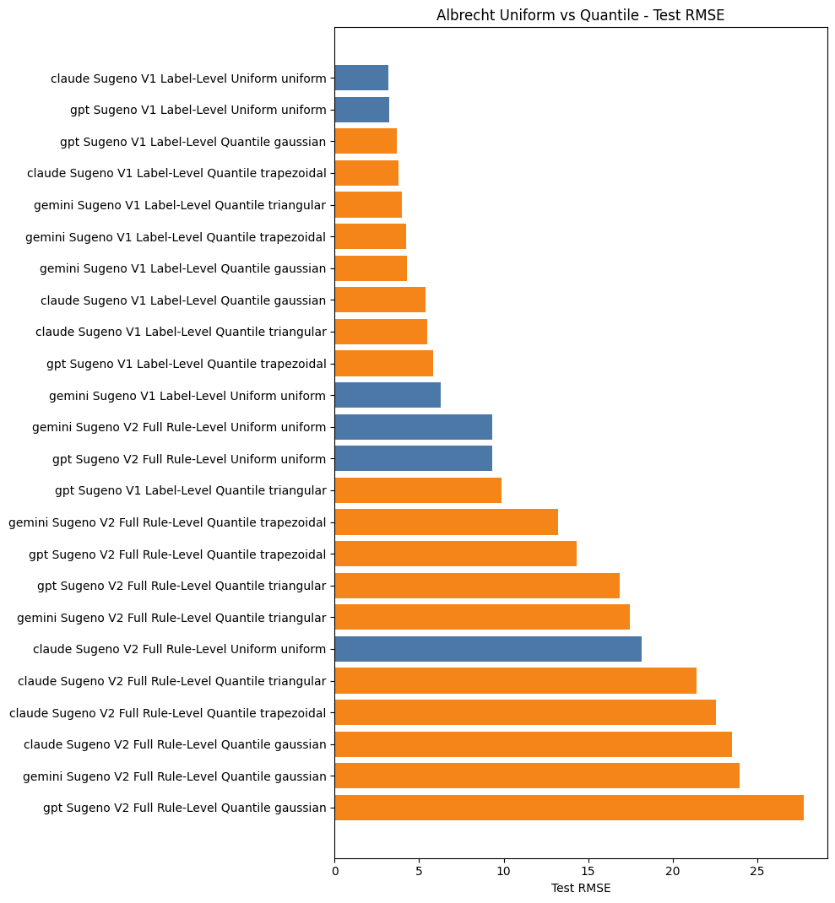
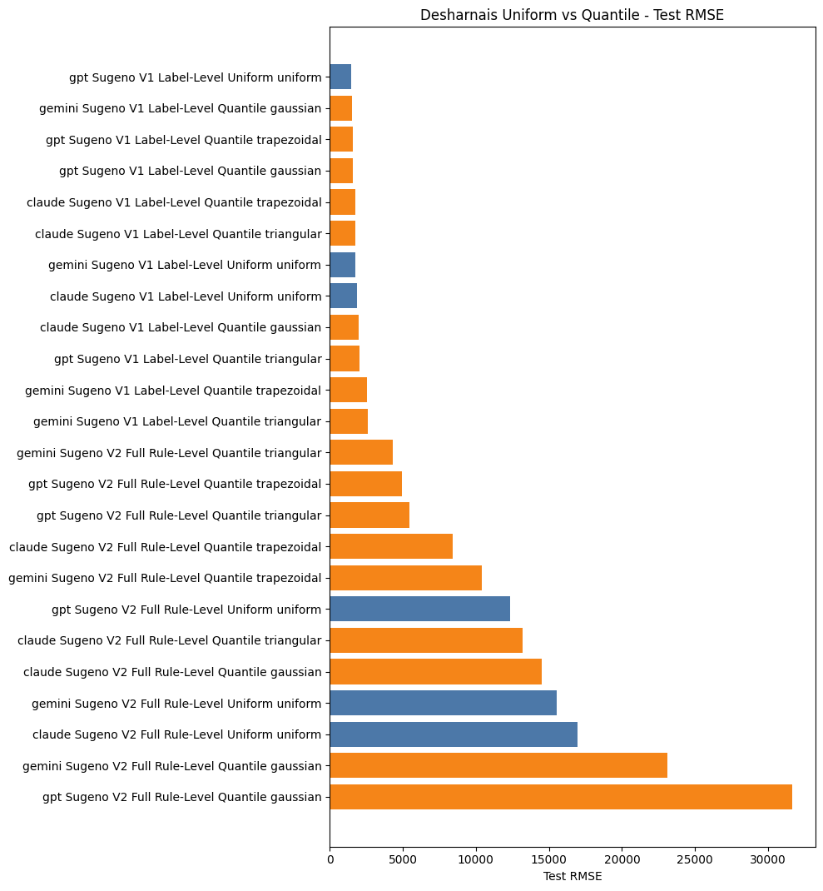
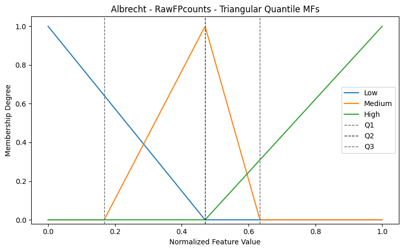
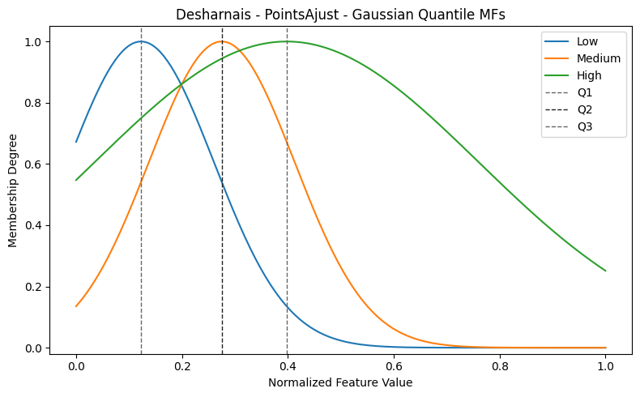
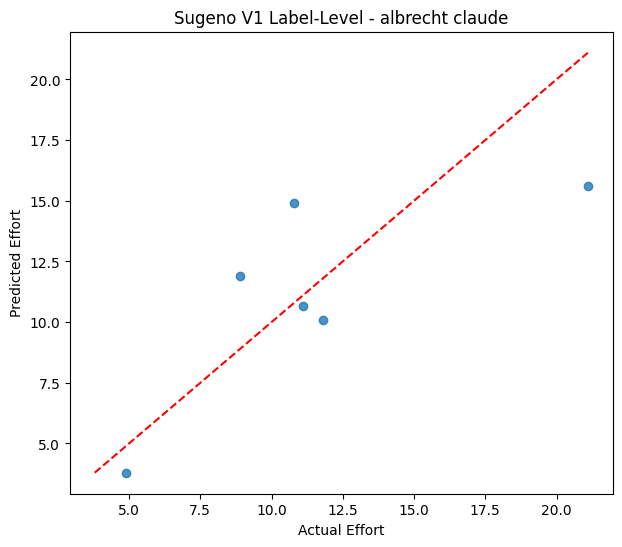
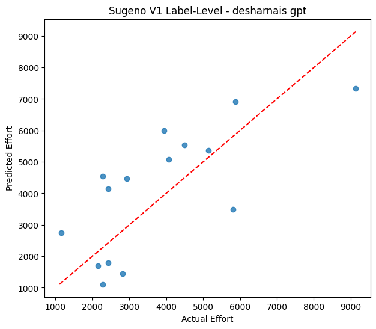

# Fuzzy Software Effort Estimation

<p align="center">
  <b>Sugeno-type fuzzy logic models for software effort estimation, with LLM-generated rule bases, uniform fuzzification, quantile-based fuzzification, and full model comparison reports.</b>
</p>

<p align="center">
  
  
  
  
</p>

---

## Table of Contents

- [Project Overview](#project-overview)
- [What This Repository Contains](#what-this-repository-contains)
- [Core Idea](#core-idea)
- [Datasets Used in the Main Experiments](#datasets-used-in-the-main-experiments)
- [Fuzzification Methods](#fuzzification-methods)
- [Sugeno Models](#sugeno-models)
- [How the Coefficients Are Learned](#how-the-coefficients-are-learned)
- [LLM Rule Bases](#llm-rule-bases)
- [Pipeline](#pipeline)
- [Repository Structure](#repository-structure)
- [Installation](#installation)
- [How to Run](#how-to-run)
- [Outputs](#outputs)
- [Results Summary](#results-summary)
- [Figures](#figures)
- [How to Read the Results](#how-to-read-the-results)
- [Important Findings](#important-findings)
- [Detailed Documentation](#detailed-documentation)
- [License](#license)

---

## Project Overview

This project predicts software development effort using Sugeno-type fuzzy inference systems. It compares classical machine learning baselines against two Sugeno model designs and two fuzzification strategies:

1. **Uniform fuzzification**
   - The original approach.
   - Membership functions are placed over fixed normalized intervals.

2. **Quantile-based fuzzification**
   - The new approach implemented in this project.
   - Membership functions are built from the actual distribution of each feature using **Q1, Q2, and Q3**.
   - The quantile pipeline is tested with:
     - `triangular`
     - `trapezoidal`
     - `gaussian`

The project also compares fuzzy rule bases produced by three LLMs:

- Gemini
- ChatGPT/GPT
- Claude

The final outputs include model metrics, predictions, learned Sugeno equations, rule dominance analysis, residual plots, predicted-vs-actual plots, Sugeno surface plots, and uniform-vs-quantile comparison figures.

---

## What This Repository Contains

This repository is not only a model implementation. It is a complete experimental workflow:

| Area | What is included |
|---|---|
| Data preprocessing | Outlier detection, outlier removal, normalization |
| Fuzzy design | Uniform and quantile-based membership functions |
| Membership functions | Triangular, trapezoidal, and Gaussian quantile MFs |
| Rule bases | LLM-generated fuzzy rules from Gemini, GPT, and Claude |
| Models | Sugeno V1 label-level and Sugeno V2 full rule-level |
| Baselines | Linear Regression and Decision Tree |
| Evaluation | RMSE, MAE, MAPE, R2, and cross-validation metrics |
| Reports | CSV summaries, prediction files, equation files, rule analysis |
| Figures | Fuzzification curves, residual plots, surfaces, comparison charts |
| Explanations | Detailed Markdown reports for the math and interpretation |

---

## Core Idea

Software effort estimation is difficult because effort depends on many uncertain and nonlinear factors. Fuzzy logic is useful because it can represent variables with human-readable linguistic levels such as:

- low
- medium
- high

Instead of using hard thresholds, fuzzy membership functions allow a project to partially belong to multiple linguistic regions at the same time.

For example, a feature value may be:

```text
RawFPcounts = 0.62

low membership    = 0.00
medium membership = 0.55
high membership   = 0.45
```

The Sugeno model then combines fuzzy rule firing strengths with learned linear equations to predict the final effort value.

---

## Datasets Used in the Main Experiments

The preprocessing pipeline can process multiple datasets under `data/raw_data`, but the main Sugeno experiments are run on **Albrecht** and **Desharnais**.

| Dataset | Input features used by Sugeno | Target |
|---|---|---|
| Albrecht | `RawFPcounts`, `Input`, `File` | `Effort` |
| Desharnais | `PointsAjust`, `TeamExp`, `Length` | `Effort` |

The input features are normalized, but the target effort values are evaluated in the original effort scale.

---

## Fuzzification Methods

### 1. Uniform Fuzzification

Uniform fuzzification uses fixed membership function ranges over the normalized input domain.

This is simple and consistent, but it does not adapt to how the feature values are actually distributed in the dataset.

Example idea:

```text
normalized feature range: 0.0 ----------------------------- 1.0

low      centered near 0.0
medium   centered near 0.5
high     centered near 1.0
```

### 2. Quantile-Based Fuzzification

Quantile fuzzification uses each feature's distribution:

```text
Q1 = 25th percentile
Q2 = 50th percentile / median
Q3 = 75th percentile
```

The membership functions are then placed around real data boundaries rather than artificial equal-width intervals.

This makes the fuzzy sets more data-aware:

| Linguistic label | Quantile meaning |
|---|---|
| Low | Values around the lower part of the observed distribution |
| Medium | Values around the median region |
| High | Values around the upper part of the observed distribution |

### Quantile Membership Function Types

The quantile pipeline tests three MF families and saves each family in its own output folder.

| MF type | Meaning | Why use it |
|---|---|---|
| `triangular` | Sharp peak around Q1/Q2/Q3 | Simple, interpretable, good first comparison |
| `trapezoidal` | Flat plateau around important regions | More tolerant around central values |
| `gaussian` | Smooth bell-shaped transition | Smoothest transitions between fuzzy labels |

---

## Sugeno Models

Two Sugeno variants are implemented and compared.

### Sugeno V1: Label-Level Model

V1 learns one consequent equation per output label.

With three inputs, each equation has:

```text
z_label = a0 + a1*x1 + a2*x2 + a3*x3
```

If there are 5 output labels, V1 learns:

```text
5 labels * 4 coefficients = 20 parameters
```

This model is usually more stable because it has fewer parameters.

### Sugeno V2: Full Rule-Level Model

V2 learns one consequent equation per fuzzy rule.

With 20 rules and three inputs:

```text
z_rule_i = a0_i + a1_i*x1 + a2_i*x2 + a3_i*x3
```

Total parameters:

```text
20 rules * 4 coefficients = 80 parameters
```

This model is more expressive, but it is also much more likely to overfit, especially on small datasets such as Albrecht.

---

## How the Coefficients Are Learned

The current V1 and V2 models do **not** use an iterative optimizer for the main reported experiments. They build a Sugeno design matrix and solve a regularized least-squares problem.

For training data:

```text
y = actual effort values
Phi = Sugeno design matrix
theta = learned coefficient vector
lambda = regularization strength
```

The model solves:

```text
theta = inverse(Phi.T * Phi + lambda * I) * Phi.T * y
```

In code, this is implemented with:

```python
params = np.linalg.solve(phi.T @ phi + reg, phi.T @ y)
```

If the matrix solve fails, the model falls back to:

```python
params = np.linalg.lstsq(phi, y, rcond=None)[0]
```

The learned parameters are saved as readable equation files under `models/`.

---

## LLM Rule Bases

The fuzzy rule bases are stored as JSON files:

| LLM | Rule file |
|---|---|
| Gemini | `models/rules_gemini.json` |
| GPT / ChatGPT | `models/rules_chatgpt.json` |
| Claude | `models/rules_claude.json` |

Each rule describes fuzzy relationships between input labels and output effort labels. The model converts these rules into internal rule-level structures and uses them to compute firing strengths.

---

## Pipeline

The complete workflow is:

```text
Raw datasets
    |
    v
Outlier analysis and removal
    |
    v
Normalization
    |
    v
Fuzzification
    |-- Uniform
    |-- Quantile using Q1, Q2, Q3
           |-- triangular
           |-- trapezoidal
           |-- gaussian
    |
    v
LLM fuzzy rules
    |
    v
Sugeno V1 and V2 training
    |
    v
Baseline comparison
    |
    v
Metrics, predictions, equations, figures, rule analysis
```

---

## Repository Structure

```text
.
|-- data/
|   |-- raw_data/
|   `-- processed_data/
|       |-- outlier_removed/
|       `-- final_normalized/
|
|-- models/
|   |-- rules_chatgpt.json
|   |-- rules_claude.json
|   |-- rules_gemini.json
|   |-- quantile_fuzzy_params/
|   |-- sugeno_equations/
|   |-- sugeno_equations_quantile/
|   |-- sugeno_label_equations/
|   `-- sugeno_label_equations_quantile/
|
|-- reports/
|   |-- explanations/
|   |-- figures/
|   |-- predictions/
|   |-- results/
|   |-- rule_analysis/
|   `-- quantile_fuzzification/
|
|-- scripts/
|   |-- run_full_sugeno.py
|   |-- run_label_level_sugeno.py
|   |-- run_quantile_fuzzification.py
|   |-- run_full_sugeno_quantile.py
|   `-- run_label_level_sugeno_quantile.py
|
|-- src/
|   |-- fuzzy_design.py
|   |-- fuzzy_design_quantile.py
|   |-- full_sugeno_model.py
|   |-- label_level_sugeno_model.py
|   |-- manual_sugeno_engine.py
|   |-- evaluation.py
|   |-- normalization.py
|   `-- outlier_analysis.py
|
|-- main.py
|-- requirements.txt
|-- LICENSE
`-- README.md
```

---

## Installation

Clone the repository:

```bash
git clone https://github.com/<your-username>/fuzzy-software-effort-estimation.git
cd fuzzy-software-effort-estimation
```

Create and activate a virtual environment:

```bash
python -m venv .venv
```

On Windows PowerShell:

```powershell
.\.venv\Scripts\Activate.ps1
```

On Linux/macOS:

```bash
source .venv/bin/activate
```

Install dependencies:

```bash
pip install -r requirements.txt
```

Dependencies:

```text
numpy
pandas
scikit-fuzzy
scikit-learn
matplotlib
seaborn
```

---

## How to Run

### 1. Preprocess Data

Runs batch outlier analysis and normalization.

```bash
python main.py
```

Main outputs:

```text
data/processed_data/outlier_removed/
data/processed_data/final_normalized/
reports/figures/
```

### 2. Run Uniform Sugeno V2

Runs the full rule-level Sugeno model with uniform fuzzification.

```bash
python scripts/run_full_sugeno.py
```

Main outputs:

```text
reports/results/full_sugeno_summary.csv
reports/results/*_model_comparison.csv
reports/predictions/
reports/figures/
models/sugeno_equations/
```

### 3. Run Uniform Sugeno V1

Runs the label-level Sugeno model and creates the final uniform comparison tables.

```bash
python scripts/run_label_level_sugeno.py
```

Main outputs:

```text
reports/results/final_all_models_summary.csv
reports/results/*_final_model_comparison.csv
reports/predictions/
reports/figures/
models/sugeno_label_equations/
```

### 4. Generate Quantile Fuzzification Artifacts

Creates Q1/Q2/Q3-based membership function parameters and plots.

```bash
python scripts/run_quantile_fuzzification.py
```

To generate specific datasets or MF types:

```bash
python scripts/run_quantile_fuzzification.py --datasets albrecht desharnais --mf-types triangular trapezoidal gaussian
```

Main outputs:

```text
models/quantile_fuzzy_params/
reports/quantile_fuzzification/
reports/figures/quantile_fuzzification/
```

### 5. Run Quantile Sugeno V2 for All MF Types

```bash
python scripts/run_full_sugeno_quantile.py --mf-type all
```

You can also run one MF type:

```bash
python scripts/run_full_sugeno_quantile.py --mf-type triangular
```

Main outputs:

```text
reports/results/quantile/<mf-type>/
reports/predictions/quantile/<mf-type>/
reports/figures/quantile/<mf-type>/
reports/rule_analysis/quantile/<mf-type>/
models/sugeno_equations_quantile/<mf-type>/
```

### 6. Run Quantile Sugeno V1 for All MF Types

```bash
python scripts/run_label_level_sugeno_quantile.py --mf-type all
```

Main outputs:

```text
reports/results/quantile/<mf-type>/
reports/predictions/quantile/<mf-type>/
reports/figures/quantile/<mf-type>/
reports/rule_analysis/quantile/<mf-type>/
models/sugeno_label_equations_quantile/<mf-type>/
```

### Recommended Full Reproduction Order

```bash
python main.py
python scripts/run_full_sugeno.py
python scripts/run_label_level_sugeno.py
python scripts/run_quantile_fuzzification.py
python scripts/run_full_sugeno_quantile.py --mf-type all
python scripts/run_label_level_sugeno_quantile.py --mf-type all
```

---

## Outputs

### Main Result Files

| File | Meaning |
|---|---|
| `reports/results/final_all_models_summary.csv` | Uniform fuzzification summary for baselines, Sugeno V1, and Sugeno V2 |
| `reports/results/full_sugeno_summary.csv` | Uniform Sugeno V2 summary |
| `reports/results/quantile/final_quantile_all_models_summary.csv` | Quantile summary across all MF types |
| `reports/results/quantile/full_sugeno_quantile_summary.csv` | Quantile Sugeno V2 summary |
| `reports/results/final_uniform_vs_quantile_comparison.csv` | Combined comparison of baseline, uniform, and quantile results |

### Prediction Outputs

Prediction files contain actual values, predicted values, residuals, and input features.

```text
reports/predictions/
reports/predictions/quantile/triangular/
reports/predictions/quantile/trapezoidal/
reports/predictions/quantile/gaussian/
```

### Equation Outputs

Learned Sugeno equations are saved in both JSON and TXT formats.

```text
models/sugeno_equations/
models/sugeno_label_equations/
models/sugeno_equations_quantile/<mf-type>/
models/sugeno_label_equations_quantile/<mf-type>/
```

### Rule Analysis Outputs

Rule analysis files explain which fuzzy rules fire most strongly and which rules dominate predictions.

```text
reports/rule_analysis/
reports/rule_analysis/quantile/<mf-type>/
```

---

## Results Summary

### Baseline Results

| Dataset | Model | Train RMSE | Test RMSE | Test R2 |
|---|---:|---:|---:|---:|
| Albrecht | Linear Regression | 4.208 | 5.838 | -0.428 |
| Albrecht | Decision Tree | 0.000 | 6.604 | -0.828 |
| Desharnais | Linear Regression | 1965.077 | 1544.636 | 0.395 |
| Desharnais | Decision Tree | 0.000 | 2692.547 | -0.840 |

### Best Uniform Sugeno V1 Results

| Dataset | Best LLM | Fuzzification | Test RMSE | Test R2 |
|---|---|---|---:|---:|
| Albrecht | Claude | Uniform | 3.173 | 0.578 |
| Desharnais | GPT | Uniform | 1483.161 | 0.442 |

### Best Quantile Sugeno V1 Results

| Dataset | Best LLM | MF type | Test RMSE | Test R2 |
|---|---|---|---:|---:|
| Albrecht | GPT | Gaussian | 3.687 | 0.430 |
| Desharnais | Gemini | Gaussian | 1498.333 | 0.430 |

### Best Quantile Sugeno V2 Results

| Dataset | Best LLM | MF type | Test RMSE | Test R2 |
|---|---|---|---:|---:|
| Albrecht | Gemini | Trapezoidal | 13.208 | -6.310 |
| Desharnais | Gemini | Triangular | 4342.355 | -3.785 |

### Best Overall Sugeno Results by Dataset

| Dataset | Best model | LLM | Fuzzification | MF type | Test RMSE | Test R2 |
|---|---|---|---|---|---:|---:|
| Albrecht | Sugeno V1 Label-Level | Claude | Uniform | mixed | 3.173 | 0.578 |
| Desharnais | Sugeno V1 Label-Level | GPT | Uniform | mixed | 1483.161 | 0.442 |

### Interpretation of the Results

The strongest results come from **Sugeno V1 Label-Level** models. V1 has fewer parameters, so it generalizes better on the available datasets.

Sugeno V2 often achieves extremely low training error, but much worse test error. This is a classic overfitting pattern caused by the larger number of parameters:

```text
Sugeno V1: 20 parameters
Sugeno V2: 80 parameters
```

Quantile fuzzification is useful for analysis because it adapts the fuzzy sets to each feature distribution. However, in the current experimental results, quantile fuzzification does not consistently beat the best uniform V1 models.

---

## Figures

### Uniform vs Quantile Comparison

These figures compare the old uniform fuzzification against the new quantile-based fuzzification.

| Albrecht RMSE comparison | Desharnais RMSE comparison |
|---|---|
|  |  |

### Quantile Membership Functions

These figures show how Q1, Q2, and Q3 shape the fuzzy sets for each feature.

| Albrecht example | Desharnais example |
|---|---|
|  |  |

### Predicted vs Actual Examples

The closer the points are to the diagonal line, the better the model predictions.

| Albrecht example | Desharnais example |
|---|---|
|  |  |

### Other Generated Figure Groups

| Figure group | Location | What it tells us |
|---|---|---|
| Outlier plots | `reports/figures/*outlier*` | Which rows were considered extreme by effort distribution |
| Fuzzification plots | `reports/figures/quantile_fuzzification/` | How each feature is converted to low/medium/high fuzzy memberships |
| Predicted vs actual | `reports/figures/` and `reports/figures/quantile/<mf-type>/` | Prediction quality and bias |
| Residual plots | `reports/figures/` and `reports/figures/quantile/<mf-type>/` | Error spread and systematic mistakes |
| Model comparison charts | `reports/figures/` and `reports/figures/quantile/<mf-type>/` | RMSE, MAE, MAPE, and R2 comparison |
| Rule dominance plots | `reports/figures/` and `reports/figures/quantile/<mf-type>/` | Which fuzzy rules dominate the inference |
| Sugeno surface plots | `reports/figures/` and `reports/figures/quantile/<mf-type>/` | Shape of the learned input-output response surface |

---

## How to Read the Results

### Metrics

| Metric | Direction | Meaning |
|---|---|---|
| RMSE | Lower is better | Penalizes large prediction errors strongly |
| MAE | Lower is better | Average absolute prediction error |
| MAPE (%) | Lower is better | Percent error relative to actual effort |
| R2 | Higher is better | Explained variance; negative means worse than predicting the mean |

### Train vs Test Behavior

| Pattern | Meaning |
|---|---|
| Low train error and low test error | Good generalization |
| Low train error and high test error | Overfitting |
| High train error and high test error | Underfitting or weak rules/features |
| Negative test R2 | Model performs worse than a mean-value baseline |

### Z Axis in Sugeno Surface Figures

The z axis is the predicted effort value.

```text
x axis = first selected input feature
y axis = second selected input feature
z axis = predicted Effort
```

The third input is fixed at `0.5` for visualization.

| Dataset | X axis | Y axis | Fixed input | Z axis |
|---|---|---|---|---|
| Albrecht | `RawFPcounts` | `Input` | `File = 0.5` | Predicted `Effort` |
| Desharnais | `PointsAjust` | `TeamExp` | `Length = 0.5` | Predicted `Effort` |

---

## Important Findings

1. **V1 is more reliable than V2 in this project.**

   V1 has fewer coefficients and therefore generalizes better on small and medium-sized datasets.

2. **V2 shows strong overfitting.**

   V2 often has near-zero training RMSE, but test RMSE becomes very large. This means the model memorized training samples instead of learning a stable relationship.

3. **Quantile fuzzification is more data-aware than uniform fuzzification.**

   It uses Q1, Q2, and Q3 for each feature, so the fuzzy sets follow the real feature distribution.

4. **Using all MF types is useful for comparison.**

   Triangular, trapezoidal, and Gaussian MFs behave differently. Testing all of them shows whether the model benefits from sharp, tolerant, or smooth membership transitions.

5. **The best current results are still from uniform Sugeno V1.**

   Quantile fuzzification adds an important experimental comparison, but the best observed test RMSE values are produced by uniform V1 models.

---

## Detailed Documentation

For deeper project explanations, see:

| Document | Purpose |
|---|---|
| `reports/explanations/full_project_report_with_comparisons.md` | Full project report with detailed comparison tables and figure placement guidance |
| `reports/explanations/sugeno_coefficient_learning_explanation.md` | Mathematical explanation of how Sugeno coefficients are learned |
| `reports/explanations/figure_groups_interpretation_guide.md` | Explanation of every figure group and what each figure tells us |
| `CODE_REVIEW_EXPLANATION.md` | Additional code-level review and explanation |

---

## Reproducibility Notes

- Train/test split uses `random_state=42`.
- Small datasets use a larger test split:

```text
test_size = 0.30 if len(df) < 50 else 0.20
```

- Cross-validation uses shuffled KFold with `random_state=42`.
- Effort metrics are calculated on the original effort scale.
- Quantile outputs are separated by MF type so results do not overwrite each other:

```text
reports/results/quantile/triangular/
reports/results/quantile/trapezoidal/
reports/results/quantile/gaussian/
```

---

## Main Source Files

| File | Responsibility |
|---|---|
| `src/fuzzy_design.py` | Original uniform fuzzy membership design |
| `src/fuzzy_design_quantile.py` | Q1/Q2/Q3 quantile-based fuzzy membership design |
| `src/manual_sugeno_engine.py` | Manual fuzzy inference and Sugeno prediction engine |
| `src/label_level_sugeno_model.py` | Sugeno V1 label-level model |
| `src/full_sugeno_model.py` | Sugeno V2 full rule-level model |
| `src/evaluation.py` | Regression metrics and baseline models |
| `src/outlier_analysis.py` | Outlier detection and plots |
| `src/normalization.py` | Feature normalization |
| `src/rules.py` | Rule loading |
| `src/rule_converter.py` | Conversion of LLM rules to internal model format |

---

## License

This project is licensed under the MIT License. See [LICENSE](LICENSE).

