# Sugeno Fuzzy Inference System for Software Effort Estimation

## Full Project Explanation, Results Comparison, and Figure Placement Guide

This Markdown file is a detailed report draft for the project:

```text
Sugeno Fuzzy Inference System ile Yazilim Efor Tahmini Yapilmasi
```

It explains what was implemented, how the experiments were run, how the models were compared, and where figures should be inserted in a final report or presentation.

---

## 1. Project Objective

The main objective of this project is to estimate software development effort using fuzzy inference and machine learning models.

The project compares:

1. `Linear Regression`
2. `Decision Tree`
3. `Sugeno V1 Label-Level First-Order Sugeno`
4. `Sugeno V2 Full Rule-Level First-Order Sugeno`

The project also compares two fuzzification strategies:

1. **Uniform fuzzification**
   - Uses fixed predefined membership function boundaries.
   - Simple and interpretable.
   - Does not adapt to the actual feature distribution.

2. **Quantile-based fuzzification**
   - Uses Q1, Q2, and Q3 values from the actual feature distribution.
   - Data-driven.
   - Tested with three membership function types:
     - `triangular`
     - `trapezoidal`
     - `gaussian`

---

## 2. Datasets Used

The project focuses mainly on two datasets:

| Dataset | Target Variable | Selected Input Variables |
|---|---|---|
| `Albrecht` | `Effort` | `RawFPcounts`, `Input`, `File` |
| `Desharnais` | `Effort` | `PointsAjust`, `TeamExp`, `Length` |

### 2.1 Albrecht Variables

| Variable | Meaning in the project |
|---|---|
| `RawFPcounts` | Functional size indicator |
| `Input` | Number/amount of input-related software functions |
| `File` | File-related complexity indicator |
| `Effort` | Actual software effort |

### 2.2 Desharnais Variables

| Variable | Meaning in the project |
|---|---|
| `PointsAjust` | Adjusted function points / functional size |
| `TeamExp` | Team experience |
| `Length` | Project length / duration indicator |
| `Effort` | Actual software effort |

---

## 3. General Workflow

The project workflow is:

1. Load raw software effort datasets.
2. Detect and remove outliers.
3. Normalize numeric input variables to `[0, 1]`.
4. Keep `Effort` in the original scale for meaningful evaluation.
5. Define fuzzy membership functions.
6. Load fuzzy rules generated from LLM rule files.
7. Train Sugeno models.
8. Train machine learning baselines.
9. Evaluate all models using train/test split and cross-validation.
10. Save predictions, equations, rule analysis, metrics, and figures.
11. Compare uniform fuzzification with quantile fuzzification.
12. Compare triangular, trapezoidal, and gaussian quantile membership functions.

---

## 4. Preprocessing and Normalization

Preprocessing includes:

- identifying the effort column,
- removing outliers,
- applying min-max normalization to numeric input variables,
- preserving the target `Effort` in the original effort scale.

The normalization step maps input variables to:

```text
0 <= x <= 1
```

This is important because fuzzy membership functions are defined on the normalized `[0, 1]` interval.

### Figure Slot: Outlier Analysis

Use this figure to show the preprocessing/outlier stage.

```markdown
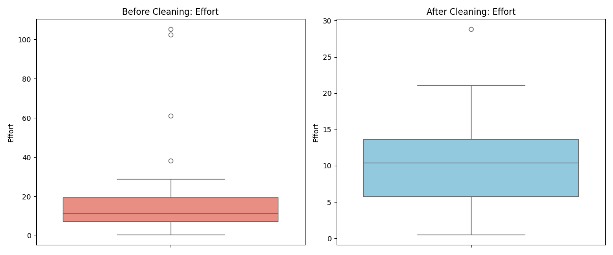
```

```markdown
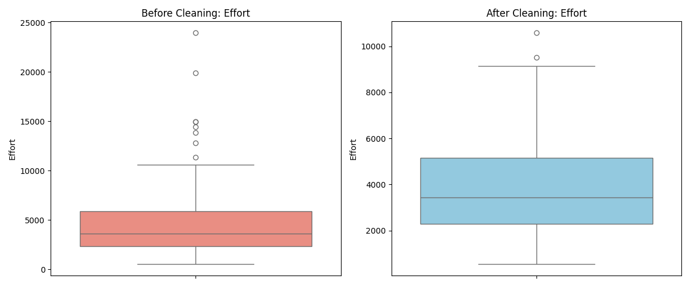
```

**What to say:** These figures show whether the datasets contain extreme effort values before modeling.

---

## 5. Fuzzification Design

Fuzzification converts numerical input values into fuzzy linguistic values:

```text
Low
Medium
High
```

For example, a normalized value `RawFPcounts = 0.4` may have:

```text
Low membership    = 0.3
Medium membership = 0.8
High membership   = 0.1
```

These membership degrees are then used to determine how strongly each fuzzy rule fires.

---

## 6. Uniform Fuzzification

Uniform fuzzification uses fixed membership functions for normalized input values.

In the current implementation:

| Term | Membership Function Type |
|---|---|
| `Low` | Trapezoidal |
| `Medium` | Gaussian |
| `High` | Triangular |

The default membership logic is implemented in:

```text
src/manual_sugeno_engine.py
src/fuzzy_design.py
```

### Meaning

Uniform fuzzification is simple and consistent across all features. However, it does not consider whether a feature's values are concentrated in a small interval or spread across the full `[0, 1]` range.

---

## 7. Quantile-Based Fuzzification

Quantile fuzzification was added to make fuzzy boundaries data-driven.

For each selected input feature, the following statistics are calculated:

```text
Q1 = 25th percentile
Q2 = 50th percentile / median
Q3 = 75th percentile
```

These values are used to define `Low`, `Medium`, and `High`.

### 7.1 Triangular Quantile MF

```text
Low    = [0, 0, Q2]
Medium = [Q1, Q2, Q3]
High   = [Q2, 1, 1]
```

### 7.2 Trapezoidal Quantile MF

```text
Low    = [0, 0, Q1, Q2]
Medium = [Q1, around Q2, around Q2, Q3]
High   = [Q2, Q3, 1, 1]
```

### 7.3 Gaussian Quantile MF

```text
Low center    = Q1
Medium center = Q2
High center   = Q3
```

Sigma values are derived from the spread between quartiles.

### Figure Slot: Quantile Membership Functions

Use these figures to show how the fuzzy sets are defined from Q1, Q2, and Q3.

```markdown

```

```markdown

```

**What to say:** These figures show how fuzzy set boundaries are adapted to the actual data distribution.

---

## 8. Fuzzy Rule Activation

Each fuzzy rule has an `IF` part and a `THEN` part.

Example:

```text
IF RawFPcounts is Low AND Input is Medium AND File is High
THEN Effort is High
```

The rule firing strength is calculated by multiplying membership degrees:

```text
w_i = mu_A(x1) * mu_B(x2) * mu_C(x3)
```

Example:

```text
RawFPcounts_Low = 0.8
Input_Medium    = 0.6
File_High       = 0.5

w_i = 0.8 * 0.6 * 0.5 = 0.24
```

Then firing strengths are normalized:

```text
w_bar_i = w_i / sum(w_i)
```

The normalized value `w_bar_i` tells how much that rule contributes to the final prediction.

---

## 9. Sugeno Model Formulation

The first-order Sugeno output equation is:

```text
f_i(x) = a_i1*x1 + a_i2*x2 + a_i3*x3 + c_i
```

The final prediction is:

```text
y_hat = sum(w_bar_i * f_i(x))
```

This means Sugeno does not use one single global equation. Instead, it combines multiple local linear equations using fuzzy rule weights.

---

## 10. Sugeno V1 Label-Level Model

`Sugeno V1 Label-Level` learns one output equation per output label.

Output labels:

```text
Very_Low
Low
Medium
High
Very_High
```

With 3 inputs:

```text
5 labels * (3 coefficients + 1 bias) = 20 parameters
```

### Meaning

V1 is less complex because multiple rules share the same label-level equation. This usually makes it more stable on small datasets.

---

## 11. Sugeno V2 Full Rule-Level Model

`Sugeno V2 Full Rule-Level` learns one output equation per fuzzy rule.

With 20 rules and 3 inputs:

```text
20 rules * (3 coefficients + 1 bias) = 80 parameters
```

### Meaning

V2 is more flexible because each rule has its own equation. However, because it learns many parameters, it can overfit, especially on small datasets such as Albrecht.

---

## 12. How Sugeno Coefficients Were Learned

For the current V1 and V2 implementations, coefficients were not manually assigned.

They were learned using a design matrix and regularized least squares:

```text
theta = (Phi.T Phi + lambda I)^(-1) Phi.T y
```

Where:

| Symbol | Meaning |
|---|---|
| `Phi` | Design matrix created from fuzzy weights and inputs |
| `theta` | Learned coefficient vector |
| `lambda` | Regularization value |
| `I` | Identity matrix |
| `y` | Actual Effort values |

Code locations:

```text
src/label_level_sugeno_model.py -> fit()
src/full_sugeno_model.py -> fit()
src/manual_sugeno_engine.py -> design_matrix()
```

---

## 13. Baseline Models

The project also trains:

1. `Linear Regression`
2. `Decision Tree`

### Linear Regression

Linear Regression learns one global equation:

```text
y_hat = a1*x1 + a2*x2 + a3*x3 + b
```

### Decision Tree

Decision Tree learns split rules from the data. It does not learn Sugeno-style linear output equations.

---

## 14. Evaluation Metrics

The project uses:

| Metric | Meaning | Better Direction |
|---|---|---|
| `RMSE` | Root Mean Squared Error | Lower is better |
| `MAE` | Mean Absolute Error | Lower is better |
| `MAPE (%)` | Mean Absolute Percentage Error | Lower is better |
| `R2` | Explained variance score | Higher is better |

Important:

```text
Low Train RMSE does not always mean good model.
If Test RMSE is high, the model may be overfitting.
```

---

## 15. Baseline Results

| Dataset | Model | Parameters | Train RMSE | Test RMSE | Test MAE | Test MAPE (%) | Test R2 |
| --- | --- | --- | --- | --- | --- | --- | --- |
| albrecht | Linear Regression | 4.000 | 4.208 | 5.838 | 3.503 | 36.632 | -0.428 |
| albrecht | Decision Tree |  | 0.000 | 6.604 | 5.250 | 41.860 | -0.828 |
| desharnais | Linear Regression | 4.000 | 1965.077 | 1544.636 | 1222.299 | 36.786 | 0.395 |
| desharnais | Decision Tree |  | 0.000 | 2692.547 | 2176.800 | 64.805 | -0.840 |

### Interpretation

Linear Regression gives a simple global baseline. Decision Tree reaches zero training error, which shows that it can memorize the training set. However, test results show whether this memorization generalizes.

---

## 16. Uniform Sugeno Results

| Dataset | LLM | Model | Parameters | Train RMSE | Test RMSE | Test MAE | Test MAPE (%) | Test R2 |
| --- | --- | --- | --- | --- | --- | --- | --- | --- |
| albrecht | gemini | Sugeno V1 Label-Level | 20.000 | 2.837 | 6.279 | 5.249 | 50.052 | -0.652 |
| albrecht | gemini | Sugeno V2 Full Rule-Level | 80.000 | 0.001 | 9.311 | 7.884 | 67.816 | -2.632 |
| albrecht | gpt | Sugeno V1 Label-Level | 20.000 | 2.937 | 3.246 | 2.933 | 28.257 | 0.558 |
| albrecht | gpt | Sugeno V2 Full Rule-Level | 80.000 | 0.001 | 9.320 | 7.516 | 68.425 | -2.640 |
| albrecht | claude | Sugeno V1 Label-Level | 20.000 | 2.668 | 3.173 | 2.641 | 23.113 | 0.578 |
| albrecht | claude | Sugeno V2 Full Rule-Level | 80.000 | 0.001 | 18.134 | 12.482 | 107.184 | -12.780 |
| desharnais | gemini | Sugeno V1 Label-Level | 20.000 | 1538.105 | 1774.508 | 1474.299 | 46.266 | 0.201 |
| desharnais | gemini | Sugeno V2 Full Rule-Level | 80.000 | 518.933 | 15527.146 | 8403.335 | 168.585 | -60.178 |
| desharnais | gpt | Sugeno V1 Label-Level | 20.000 | 1544.109 | 1483.161 | 1350.139 | 46.044 | 0.442 |
| desharnais | gpt | Sugeno V2 Full Rule-Level | 80.000 | 517.703 | 12344.950 | 6266.044 | 130.948 | -37.672 |
| desharnais | claude | Sugeno V1 Label-Level | 20.000 | 1394.655 | 1873.257 | 1668.749 | 56.518 | 0.110 |
| desharnais | claude | Sugeno V2 Full Rule-Level | 80.000 | 516.908 | 16973.944 | 9080.104 | 184.975 | -72.111 |

### Interpretation

Uniform V1 is usually more stable than uniform V2. V2 often has very low training RMSE but much worse test RMSE, which is a strong overfitting signal.

---

## 17. Quantile Sugeno Results

The following table compares quantile fuzzification across three MF types:

- `triangular`
- `trapezoidal`
- `gaussian`

| Dataset | LLM | Model | MF Type | Parameters | Train RMSE | Test RMSE | Test MAE | Test MAPE (%) | Test R2 |
| --- | --- | --- | --- | --- | --- | --- | --- | --- | --- |
| albrecht | gemini | Sugeno V1 Label-Level | triangular | 20.000 | 2.655 | 3.980 | 3.400 | 35.260 | 0.336 |
| albrecht | gemini | Sugeno V2 Full Rule-Level | triangular | 80.000 | 0.001 | 17.473 | 14.590 | 118.598 | -11.793 |
| albrecht | gpt | Sugeno V1 Label-Level | triangular | 20.000 | 2.297 | 9.848 | 6.462 | 62.469 | -3.064 |
| albrecht | gpt | Sugeno V2 Full Rule-Level | triangular | 80.000 | 0.001 | 16.873 | 11.761 | 111.282 | -10.929 |
| albrecht | claude | Sugeno V1 Label-Level | triangular | 20.000 | 2.546 | 5.499 | 4.040 | 34.887 | -0.267 |
| albrecht | claude | Sugeno V2 Full Rule-Level | triangular | 80.000 | 0.001 | 21.382 | 12.852 | 116.608 | -18.157 |
| desharnais | gemini | Sugeno V1 Label-Level | triangular | 20.000 | 1812.239 | 2614.550 | 1721.464 | 49.535 | -0.735 |
| desharnais | gemini | Sugeno V2 Full Rule-Level | triangular | 80.000 | 1291.157 | 4342.355 | 3747.953 | 112.277 | -3.785 |
| desharnais | gpt | Sugeno V1 Label-Level | triangular | 20.000 | 1775.199 | 2039.467 | 1381.718 | 34.761 | -0.055 |
| desharnais | gpt | Sugeno V2 Full Rule-Level | triangular | 80.000 | 1105.586 | 5426.988 | 3622.244 | 93.860 | -6.474 |
| desharnais | claude | Sugeno V1 Label-Level | triangular | 20.000 | 1473.591 | 1766.459 | 1494.546 | 46.855 | 0.208 |
| desharnais | claude | Sugeno V2 Full Rule-Level | triangular | 80.000 | 396.103 | 13218.906 | 8521.745 | 240.145 | -43.341 |
| albrecht | gemini | Sugeno V1 Label-Level | trapezoidal | 20.000 | 2.754 | 4.227 | 3.605 | 37.092 | 0.251 |
| albrecht | gemini | Sugeno V2 Full Rule-Level | trapezoidal | 80.000 | 0.001 | 13.208 | 11.142 | 100.421 | -6.310 |
| albrecht | gpt | Sugeno V1 Label-Level | trapezoidal | 20.000 | 2.541 | 5.828 | 4.188 | 40.424 | -0.423 |
| albrecht | gpt | Sugeno V2 Full Rule-Level | trapezoidal | 80.000 | 0.001 | 14.328 | 9.470 | 90.520 | -7.603 |
| albrecht | claude | Sugeno V1 Label-Level | trapezoidal | 20.000 | 2.600 | 3.793 | 3.189 | 27.038 | 0.397 |
| albrecht | claude | Sugeno V2 Full Rule-Level | trapezoidal | 80.000 | 0.001 | 22.553 | 12.063 | 110.447 | -20.314 |
| desharnais | gemini | Sugeno V1 Label-Level | trapezoidal | 20.000 | 1814.375 | 2540.090 | 1709.866 | 51.158 | -0.637 |
| desharnais | gemini | Sugeno V2 Full Rule-Level | trapezoidal | 80.000 | 1291.472 | 10387.258 | 6442.809 | 149.347 | -26.379 |
| desharnais | gpt | Sugeno V1 Label-Level | trapezoidal | 20.000 | 1773.933 | 1589.810 | 1251.302 | 35.157 | 0.359 |
| desharnais | gpt | Sugeno V2 Full Rule-Level | trapezoidal | 80.000 | 1105.846 | 4936.690 | 3534.671 | 106.824 | -5.184 |
| desharnais | claude | Sugeno V1 Label-Level | trapezoidal | 20.000 | 1497.999 | 1728.718 | 1450.321 | 44.920 | 0.242 |
| desharnais | claude | Sugeno V2 Full Rule-Level | trapezoidal | 80.000 | 397.306 | 8410.667 | 5801.325 | 209.791 | -16.950 |
| albrecht | gemini | Sugeno V1 Label-Level | gaussian | 20.000 | 3.260 | 4.280 | 3.360 | 28.260 | 0.233 |
| albrecht | gemini | Sugeno V2 Full Rule-Level | gaussian | 80.000 | 0.009 | 23.925 | 15.935 | 148.846 | -22.985 |
| albrecht | gpt | Sugeno V1 Label-Level | gaussian | 20.000 | 3.156 | 3.687 | 3.140 | 26.314 | 0.430 |
| albrecht | gpt | Sugeno V2 Full Rule-Level | gaussian | 80.000 | 0.017 | 27.752 | 17.464 | 162.007 | -31.271 |
| albrecht | claude | Sugeno V1 Label-Level | gaussian | 20.000 | 3.135 | 5.386 | 3.663 | 30.256 | -0.215 |
| albrecht | claude | Sugeno V2 Full Rule-Level | gaussian | 80.000 | 0.011 | 23.511 | 14.138 | 132.627 | -22.163 |
| desharnais | gemini | Sugeno V1 Label-Level | gaussian | 20.000 | 1496.049 | 1498.333 | 1215.612 | 39.168 | 0.430 |
| desharnais | gemini | Sugeno V2 Full Rule-Level | gaussian | 80.000 | 285.661 | 23096.876 | 8359.596 | 163.737 | -134.370 |
| desharnais | gpt | Sugeno V1 Label-Level | gaussian | 20.000 | 1520.660 | 1598.423 | 1320.793 | 41.493 | 0.352 |
| desharnais | gpt | Sugeno V2 Full Rule-Level | gaussian | 80.000 | 317.815 | 31657.045 | 11474.631 | 230.373 | -253.305 |
| desharnais | claude | Sugeno V1 Label-Level | gaussian | 20.000 | 1400.878 | 1996.319 | 1548.560 | 44.117 | -0.011 |
| desharnais | claude | Sugeno V2 Full Rule-Level | gaussian | 80.000 | 331.043 | 14488.818 | 6470.520 | 142.720 | -52.270 |

### Interpretation

Quantile fuzzification changes the rule activation pattern because membership functions are built from the actual feature distribution. However, quantile fuzzification does not automatically guarantee better performance. The results must be compared using test metrics.

V2 still frequently overfits because it has 80 parameters.

---

## 18. Best Observed Sugeno Results by Test RMSE

This table selects the best Sugeno result for each dataset and Sugeno model type using lowest Test RMSE.

| Dataset | LLM | Model | Fuzzification | MF Type | Parameters | Train RMSE | Test RMSE | Test MAE | Test MAPE (%) | Test R2 |
| --- | --- | --- | --- | --- | --- | --- | --- | --- | --- | --- |
| albrecht | claude | Sugeno V1 Label-Level | Uniform | uniform | 20.000 | 2.668 | 3.173 | 2.641 | 23.113 | 0.578 |
| albrecht | gemini | Sugeno V2 Full Rule-Level | Uniform | uniform | 80.000 | 0.001 | 9.311 | 7.884 | 67.816 | -2.632 |
| desharnais | gpt | Sugeno V1 Label-Level | Uniform | uniform | 20.000 | 1544.109 | 1483.161 | 1350.139 | 46.044 | 0.442 |
| desharnais | gemini | Sugeno V2 Full Rule-Level | Quantile | triangular | 80.000 | 1291.157 | 4342.355 | 3747.953 | 112.277 | -3.785 |

### Interpretation

The best V1 results are more stable than V2 results. V2 can fit training data extremely well, but test errors remain high. This is consistent with overfitting due to high parameter count.

---

## 19. Figure Placement Plan for Final Report

Use this section as a guide when building the final document.

### 19.1 Data Preprocessing Figures

Place after the preprocessing explanation.

```markdown

```

```markdown

```

Caption:

```text
Figure X. Outlier analysis for the selected effort dataset.
```

---

### 19.2 Quantile Membership Function Figures

Place after the fuzzification explanation.

```markdown

```

```markdown

```

Caption:

```text
Figure X. Quantile-based Low, Medium, and High membership functions with Q1, Q2, and Q3 markers.
```

---

### 19.3 Predicted vs Actual Figures

Place after model evaluation.

```markdown
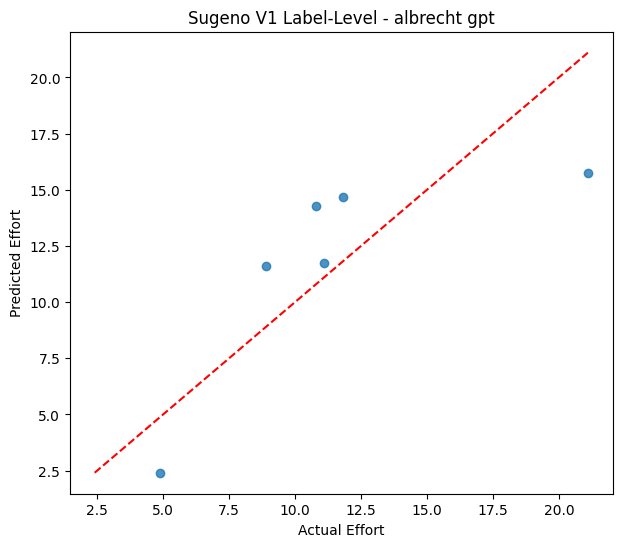
```

```markdown

```

Caption:

```text
Figure X. Actual effort values compared with predicted effort values.
```

Interpretation:

```text
Points closer to the red diagonal line indicate better prediction accuracy.
```

---

### 19.4 Residual Figures

Place after predicted vs actual plots.

```markdown
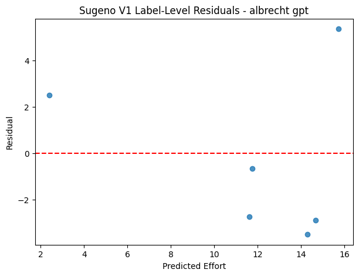
```

```markdown
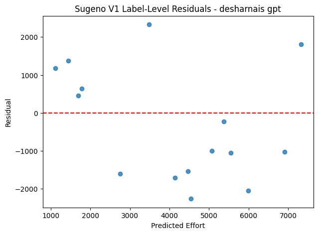
```

Caption:

```text
Figure X. Residual distribution of the Sugeno model.
```

Interpretation:

```text
Residuals should be distributed around zero without a strong visible pattern.
```

---

### 19.5 Sugeno Surface Figures

Place after explaining Sugeno inference.

```markdown
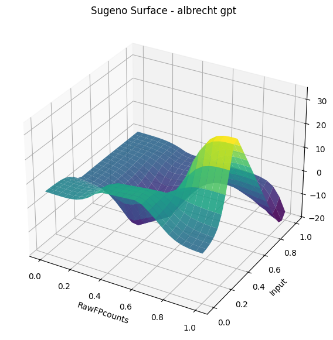
```

```markdown
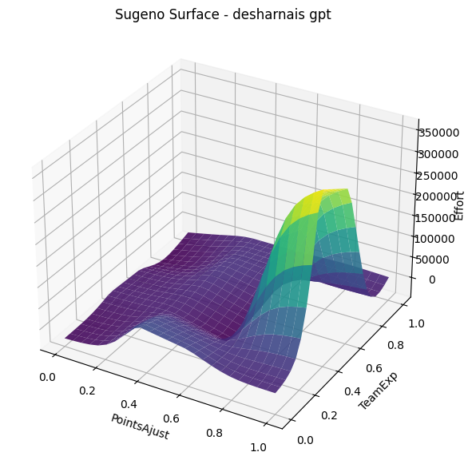
```

Caption:

```text
Figure X. Sugeno prediction surface showing predicted effort as two inputs vary.
```

Notes:

| Dataset | x-axis | y-axis | fixed variable | z-axis |
|---|---|---|---|---|
| Albrecht | `RawFPcounts` | `Input` | `File = 0.5` | predicted `Effort` |
| Desharnais | `PointsAjust` | `TeamExp` | `Length = 0.5` | predicted `Effort` |

---

### 19.6 Rule Dominance Figures

Place in the model interpretability section.

```markdown
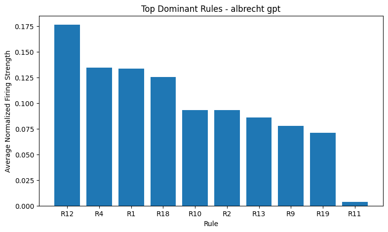
```

```markdown
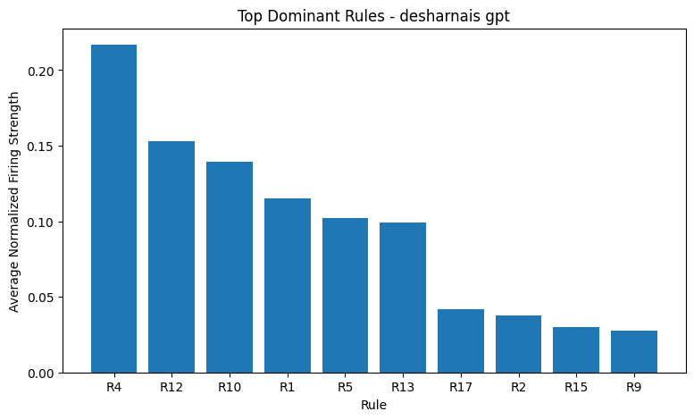
```

Caption:

```text
Figure X. Average normalized firing strength of the most dominant fuzzy rules.
```

Interpretation:

```text
Higher bars show rules that contribute more frequently or more strongly to model predictions.
```

---

### 19.7 Model Comparison Figures

Place after result tables.

```markdown
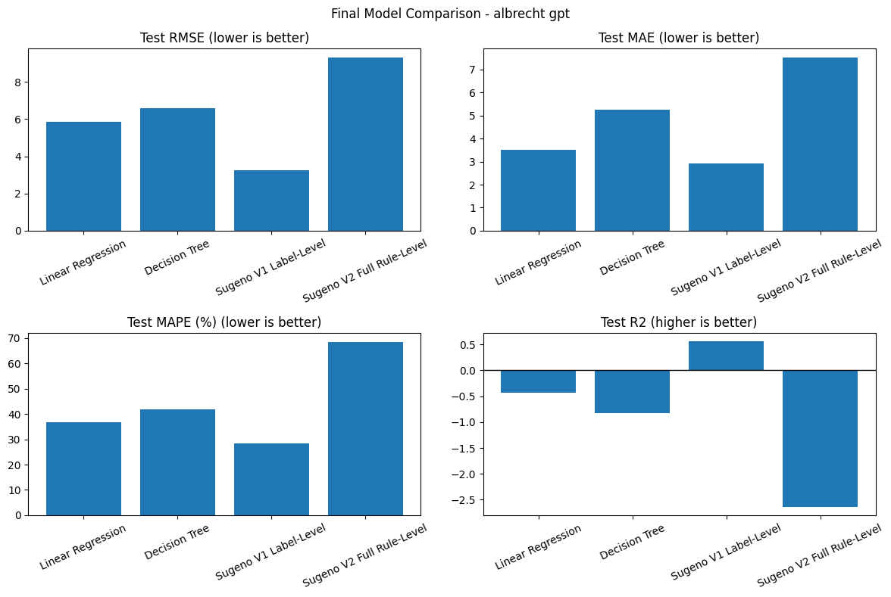
```

```markdown
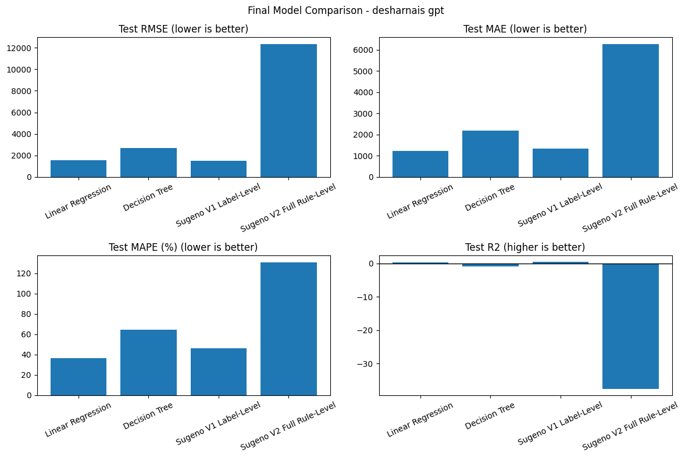
```

Caption:

```text
Figure X. Final comparison of baseline models and Sugeno models using RMSE, MAE, MAPE, and R2.
```

---

### 19.8 Aggregate Comparison Figures

Place in the final comparison section.

```markdown
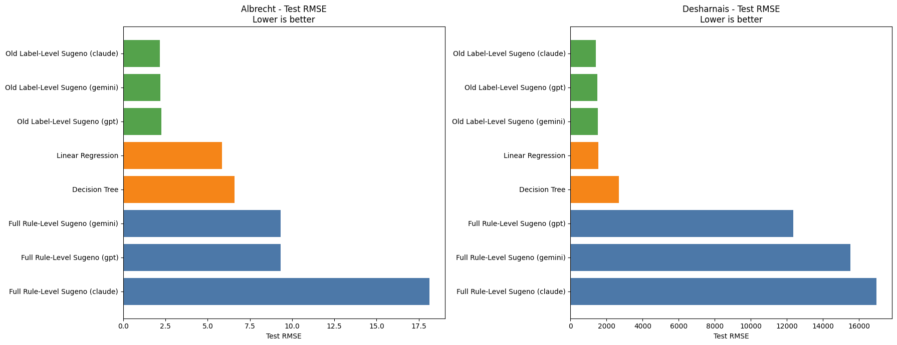
```

```markdown
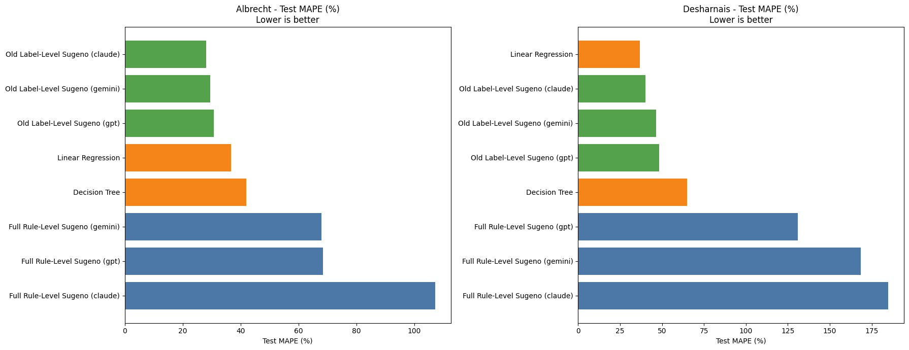
```

Caption:

```text
Figure X. Aggregate comparison of all model families across datasets.
```

---

### 19.9 Uniform vs Quantile Figures

Place in the fuzzification comparison section.

```markdown

```

```markdown

```

Caption:

```text
Figure X. Uniform fuzzification compared with quantile fuzzification using RMSE.
```

---

### 19.10 MF-Type Specific Quantile Figures

Use these when comparing triangular, trapezoidal, and gaussian quantile experiments.

```markdown
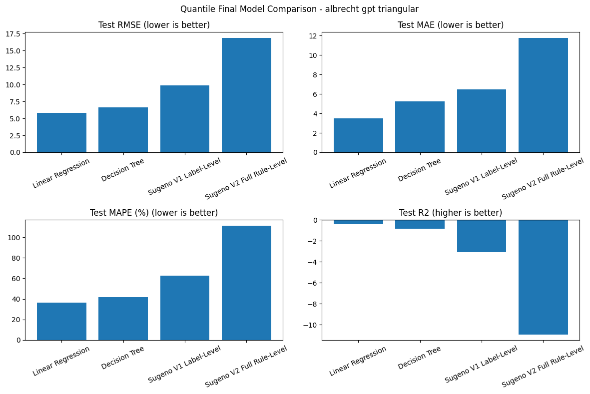
```

```markdown
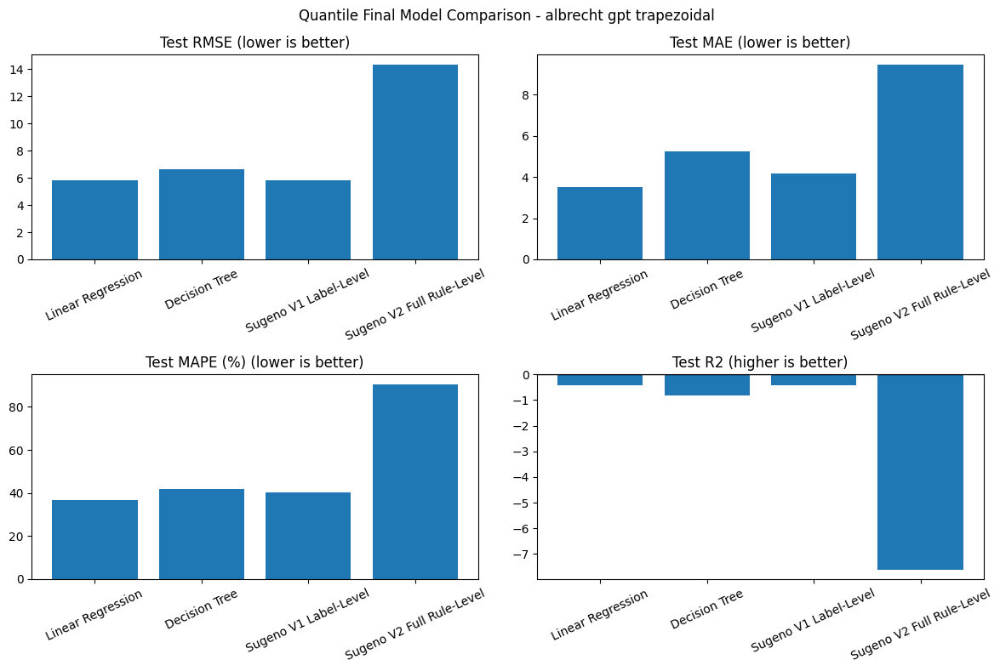
```

```markdown
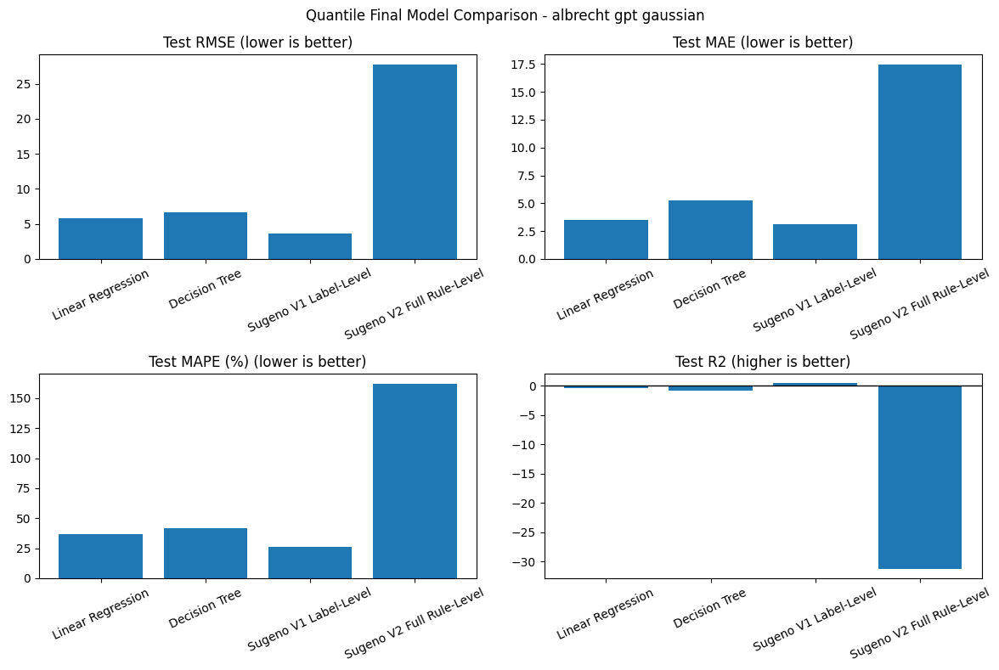
```

Caption:

```text
Figure X. Comparison of quantile membership function types for Sugeno model performance.
```

---

## 20. Discussion

The results show that model complexity is a critical factor.

### 20.1 V1 Stability

Sugeno V1 has 20 parameters. Because several fuzzy rules share the same label-level output equation, the model is less likely to memorize the training data.

This makes V1 more stable, especially for smaller datasets.

### 20.2 V2 Overfitting

Sugeno V2 has 80 parameters. This gives the model more flexibility, but also increases overfitting risk.

In the results, V2 often has extremely low training RMSE but much higher test RMSE. This means the model fits the training data very well but does not generalize well.

### 20.3 Quantile Fuzzification

Quantile fuzzification adapts fuzzy boundaries to the actual data distribution. This is theoretically useful because it can balance rule activation.

However, the experimental results show that quantile fuzzification must be evaluated carefully. It improves some cases but does not automatically outperform uniform fuzzification in every case.

### 20.4 Membership Function Type

The three quantile MF types behave differently:

| MF Type | Meaning |
|---|---|
| `triangular` | Simple and sharp transitions |
| `trapezoidal` | Stable plateau regions |
| `gaussian` | Smooth continuous transitions |

The best MF type depends on dataset, model type, and LLM rule source.

---

## 21. Main Findings

1. `Sugeno V1 Label-Level` is generally more stable than `Sugeno V2 Full Rule-Level`.
2. `Sugeno V2` frequently overfits because it learns 80 parameters.
3. Very low training error does not guarantee good test performance.
4. Quantile fuzzification provides a data-driven alternative to fixed uniform boundaries.
5. Triangular, trapezoidal, and gaussian quantile MFs should be treated as separate experiments.
6. Linear Regression remains a strong simple baseline in some cases.
7. Decision Tree can memorize the training data, but test results reveal whether it generalizes.

---

## 22. Report-Ready Conclusion

This project implemented and compared software effort estimation models using Sugeno fuzzy inference and machine learning baselines. The selected datasets were Albrecht and Desharnais, and each dataset was represented using three normalized input variables with `Effort` as the target variable. The study evaluated two Sugeno designs: V1 Label-Level Sugeno, which learns one equation per output label, and V2 Full Rule-Level Sugeno, which learns one equation per fuzzy rule. V1 contains 20 parameters, while V2 contains 80 parameters.

The experiments show that V2 is more flexible but more prone to overfitting, especially when the number of training samples is small. In many cases V2 produced almost zero training error but poor test performance, indicating memorization. V1 was generally more stable because it uses fewer parameters and shares equations across output labels.

The project also introduced quantile-based fuzzification using Q1, Q2, and Q3 values for each input feature. This made the fuzzy boundaries data-driven rather than fixed. Quantile fuzzification was tested with triangular, trapezoidal, and gaussian membership functions, and results were saved separately for each MF type. The comparison showed that quantile fuzzification changes model behavior and can improve some cases, but it does not universally outperform uniform fuzzification. Therefore, fuzzification type and membership function shape should be evaluated experimentally for each dataset.

Overall, the project demonstrates that Sugeno fuzzy inference can provide interpretable local linear models for software effort estimation, but model complexity must be controlled carefully to avoid overfitting.

---

## 23. Short Presentation Script

In this project, we estimated software development effort using Sugeno fuzzy inference models and baseline machine learning models. We used Albrecht and Desharnais datasets. First, we cleaned outliers and normalized input variables. Then we applied fuzzy membership functions to convert numerical inputs into Low, Medium, and High fuzzy terms.

We implemented two Sugeno models. The first one is Sugeno V1 Label-Level, which learns one equation per output label and has 20 parameters. The second one is Sugeno V2 Full Rule-Level, which learns one equation per rule and has 80 parameters. The coefficients were learned automatically from data using regularized least squares.

We compared uniform fuzzification with quantile-based fuzzification. Quantile fuzzification uses Q1, Q2, and Q3 values from each feature's distribution. We tested triangular, trapezoidal, and gaussian membership functions separately.

The main result is that V1 is more stable, while V2 often overfits because it has too many parameters. Quantile fuzzification is useful because it is data-driven, but it must be compared experimentally because it does not always outperform uniform fuzzification.

